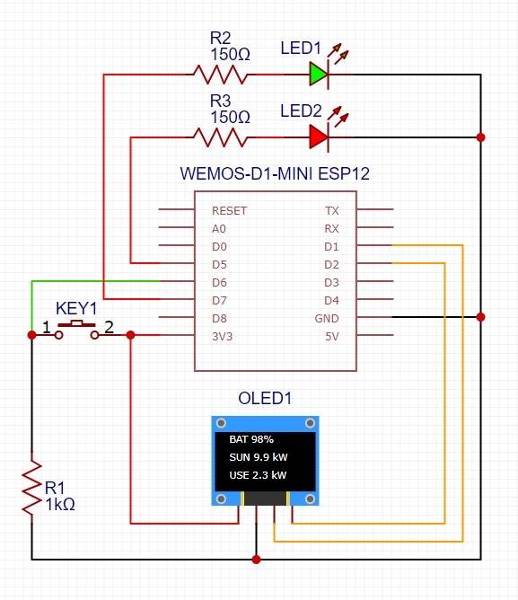
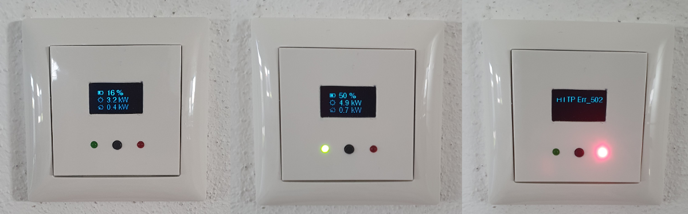

# SunShareESP8266Client

Client application that accesses the `SunShareAPI` to display inverter data.



D1 = SCL  
D2 = SDA

## Parts

| ID    | Description                                         |
| ----- | --------------------------------------------------- |
| LED1  | High gain indicator LED                             |
| LED2  | Error / message LED                                 |
| KEY1  | Switch that toggles through different display modes |
| OLED1 | 128x64 px OLED I2C screen                           |
| R1    | 10kΩ pull-down resistor for KEY1                    |
| R2    | Current limiting resistor for LED1                  |
| R3    | Current limiting resistor for LED2                  |
| WEMOS | WEMOS D1 Mini board with an ESP8266 chip (v. 12)    |

## Code setup

1. Create a file named `credentials.h` inside the **include/** folder.
2. Expose your wifi credentials in the following manner:

```c
#if !defined(CREDS_H)
#define CREDS_H

char *ssid = "YOUR_WIFI_SSID";
char *password = "YOUR_WIFI_PASSWORD";

#endif // CREDS_H

```

3. Adjust the API-Endpoint inside `main.cpp` to the address where your SunShareAPI is running (e.g replace `rpi2-node-1` with an ip address of your choice):

```c
InverterDataProvider data_provider("http://rpi2-node-1/inverter-data");
```

## Display modes

With the KEY1 button, mentioned above, it's possible to switch through different display modes. The default display mode (MODE1) shows the current battery level, yield and the power consumption.

- MODE1: Battery level / yield / power consumption
- MODE2: Large battery icon
- MODE3: Age of the dataset that is displayed (timestamp)

More content (incl. pictures) coming soon...

## Visual prototype



- Left: Normal state
- Center: High gain
- Right: Error
